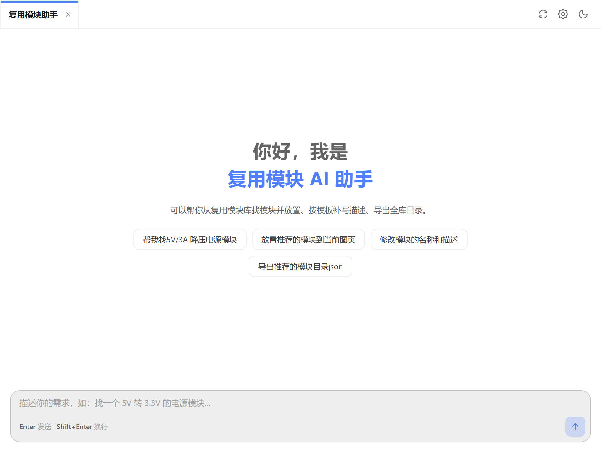
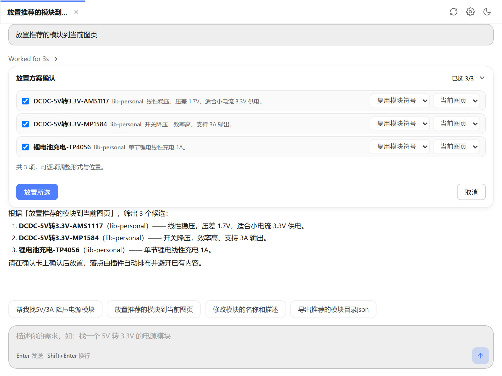
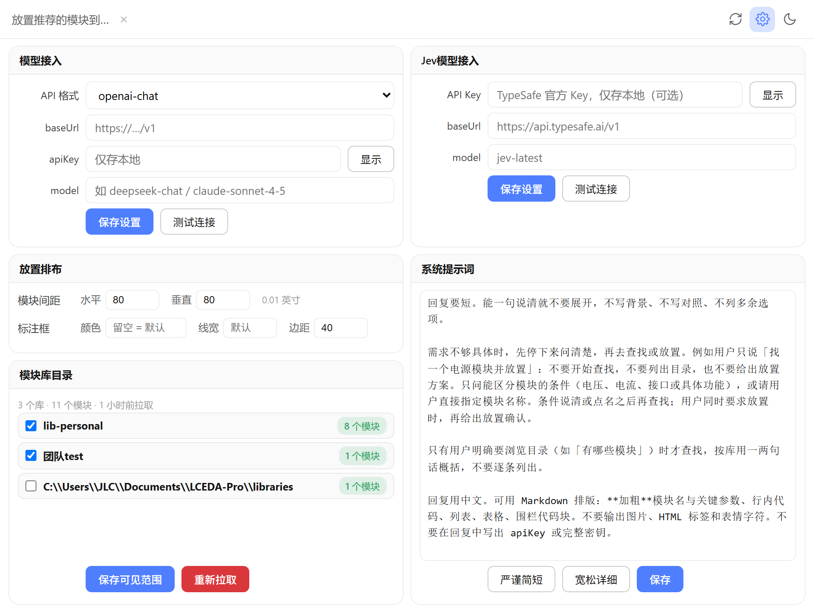

# 复用模块智能助手

嘉立创EDA专业版（EasyEDA）扩展。在原理图里用自然语言从复用模块库找模块，确认后再放置；也可以改名称和描述、导出目录。

放置、改库、导出都会先出确认卡。确认前不改动画布，也不写库。

原理图顶栏 → **AI Reuse Block Placement → Open AI Reuse Block Placement...** 打开面板（960×720，可最大化）。

## 界面

空会话，以及找到模块后的放置确认卡：

| 空会话                                          | 对话与放置确认                                            |
| -------------------------------------------- | -------------------------------------------------- |
|  |  |

设置页：模型接入、Jev模型接入、放置排布、系统提示词、模块库目录。

## 使用

### 先配置模型

打开右上角设置。

- **模型接入**（必填）：API 格式（`openai-chat` / `openai-responses` / `anthropic`）、`baseUrl`、`apiKey`、`model`。保存后可测试连接。未配置时，对话会引导到这里。
- **Jev模型接入**（可选）：TypeSafe 决策模型，用于口语化需求的语义推荐。不配也能用，找模块会退回关键词检索。默认 `baseUrl` 为 `https://api.typesafe.ai/v1`，`model` 为 `jev-latest`。
- **模块库目录**：个人库、团队库、本地库会按当前客户端模式检测。勾选可见范围后保存；需要最新目录时点「重新拉取」。也可以导入此前导出的目录 JSON：先对照相同、冲突、文件多出和同一库里文件没有的模块，再选择保留现有、采用文件或按更新时间合并。文件没提到的库不会被清掉。「导出目录」只另存当前勾选的库。

### 对话里可以做的事

| 你说       | 插件做                                                                      |
| -------- | ------------------------------------------------------------------------ |
| 找模块      | 型号或名称走关键词检索。功能描述（如「找个能降压供电的」）在配置了 Jev 后走语义推荐，并给出匹配度。                     |
| 放置       | 明确要求放置时出示确认卡。默认**复用模块符号**，可逐项改成图页。位置可选当前图页、新建图页、新板子或新工程。落点按网格排布，并避开已有内容。 |
| 改名称 / 描述 | 读取模块自带原理图后出示编辑确认卡。                                                       |
| 导出目录     | 导出 JSON。可指定模块，也可导出当前可见目录。                                                |

确认卡不在模型的工具列表里。勾选并确认后才执行；目录重新拉取后，未确认的旧卡作废。

清空对话只重置当前会话，已拉取的目录还在。

### 放置排布

在设置里调模块间距，以及标注框的颜色、线宽、边距。
